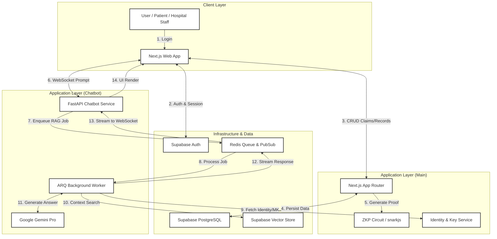

# Claimly: Privacy-Preserving Health Insurance Claim Verification System

Claimly adalah sebuah platform web fullstack yang memfasilitasi proses pengajuan dan verifikasi klaim asuransi kesehatan dengan mengutamakan privasi. Sistem ini menjembatani interaksi antara **Rumah Sakit**, **Pasien**, dan **Perusahaan Asuransi**. 

Tujuan utama Claimly adalah menggunakan teknologi kriptografi mutakhir untuk memverifikasi keabsahan sebuah klaim asuransi tanpa perlu menyerahkan data rekam medis sensitif kepada pihak asuransi.

---

## 🏗️ Arsitektur Sistem & Alur Pengguna

Sistem Claimly terdiri dari modul Next.js utama untuk manajemen dan verifikasi, serta modul Chatbot RAG terpisah untuk asisten medis pintar.



---

## 1. Deskripsi Projek

Claimly menggunakan **Zero-Knowledge Proof (ZKP)** (diimplementasikan dengan Circom dan snarkjs) secara off-chain untuk membuktikan bahwa sebuah proses medis yang dijalani pasien memenuhi syarat polis asuransinya. 

Alur utama dalam sistem ini adalah:
1. Pihak Rumah Sakit memasukkan data klaim dan diagnosis medis.
2. Sistem *backend* menghasilkan ZK Proof.
3. Proof dan data non-sensitif (signals) dikirimkan ke asuransi.
4. Pihak Asuransi memverifikasi proof tersebut dan memutuskan untuk menyetujui (approve) atau menolak (reject) klaim.

Proses ini memastikan bahwa asuransi tidak akan pernah melihat detail diagnosis pasien, tanggal diagnosis, maupun detail rahasia lainnya.

---

## 🤖 Claimly RAG Chatbot Service

Untuk meningkatkan pengalaman pengguna, kami menyediakan layanan chatbot medis asinkron yang mampu memberikan wawasan dari rekam medis terenkripsi tanpa mengorbankan privasi.

*   **Repository**: [claimly-rag-chatbot](https://github.com/leeCode83/claimly-rag-chatbot)
*   **Keunggulan**: Memproses data rekam medis secara "Zero-Persistence" (hanya ada di memori saat diproses).
*   **Keamanan**: Dekripsi on-the-fly di RAM menggunakan ECIES dan AES-GCM.

### Cara Menjalankan Chatbot (Quick Start):
1.  Buka terminal di folder `claimly-rag-chatbot`.
2.  Jalankan 4 background workers:
    ```powershell
    .\run_workers.ps1
    ```
3.  Jalankan FastAPI API:
    ```powershell
    .\run_api.ps1
    ```
    *Layanan akan tersedia di port 8000 via WebSocket.*

---

## 2. Problem Statement yang Mau Diselesaikan

Saat ini, proses klaim asuransi kesehatan di Indonesia mengharuskan pihak rumah sakit mengirimkan rekam medis pasien secara menyeluruh—termasuk kode diagnosis, riwayat kondisi, dan detail medis lainnya—kepada pihak perusahaan asuransi. Praktik ini menciptakan dua masalah fundamental:

1. **Privasi pasien terancam:** Data medis sensitif yang dikirim ke asuransi dapat disalahgunakan, misalnya untuk menaikkan premi di perpanjangan polis berikutnya, digunakan untuk menolak klaim penyakit terkait di masa depan, atau bahkan terancam bocor akibat celah keamanan data. Padahal, pihak asuransi sebenarnya hanya perlu mengetahui *apakah prosedur medis tersebut merupakan hak pasien dan sesuai dengan polis yang berlaku*.
2. **Tidak ada sistem verifikasi "buta" (*blind verification*):** Belum ada mekanisme di mana asuransi bisa 100% yakin akan keabsahan klaim tanpa harus membedah seluruh data historis pasien secara langsung.

---

## 3. Fitur Utama Projek

* **Manajemen Pengguna & Akses (RBAC):** Pemisahan hak akses ketat antara `hospital_staff`, `insurance_reviewer`, dan `patient`. Data medis terenkripsi dan hanya dapat dikelola oleh pihak rumah sakit.
* **Manajemen Polis Asuransi:** Fitur bagi reviewer asuransi untuk mengatur template polis, mencakup daftar diagnosis dan prosedur yang ditanggung (diubah menjadi *Merkle Tree* di balik layar).
* **Pendaftaran Pasien & Polis:** Pendaftaran pasien oleh rumah sakit yang kemudian dihubungkan ke polis asuransi valid untuk men-generate `policyCommitment` identifier.
* **Input Data Medis Terselubung:** Staf rumah sakit dapat memasukkan diagnosis kode ICD-10 dan laporan medis yang disimpan terenkripsi sempurna (*encrypted database*).
* **Pengajuan Klaim dengan ZKP:** Otomatisasi pembuatan ZK Proof di sisi server tanpa pernah menyimpan data medis dalam format yang bisa diakses asuransi setelah proof digenerate.
* **Dashboard Klaim untuk Asuransi:** Mengelola tumpukan klaim masuk dengan data publik (prosedur, nominal) dan memverifikasi kriptografi integritas klaim.
* **Notifikasi Status Klaim (Pasien):** Portal sederhana bagi pasien untuk memantau status persetujuan klaim mereka.
* **Audit Trail/Logs Log:** Semua aktivitas kritis (submit klaim, proof generation, approval) tercatat permanen dan tidak dapat dihapus.
* **AI Medical Assistant (RAG Chatbot):** Tanya jawab seputar rekam medis dengan konteks medis akurat menggunakan Google Gemini Pro.

---

## 4. Tech Stack yang Digunakan

### Core Web & Management
* **Frontend/Backend:** Next.js 14 (App Router).
* **Identity & Management:** Next.js Server Actions & Identity API.
* **BaaS:** Supabase (Auth, PostgreSQL, Storage).
* **Zero-Knowledge Proof (ZKP):** Circom & snarkjs (Poseidon Hash, Merkle Proof).

### AI & Chatbot Service
* **API Service:** FastAPI (Python) dengan Winloop (IOCP) untuk optimasi Windows.
* **Background Worker:** ARQ (Redis based job queue).
* **LLM Engine:** Google Gemini Pro API.
* **Vector Store:** Supabase Vector (pgvector).
* **Message Broker:** Redis (Queue & Pub/Sub for real-time streaming).

---

## 5. Peran ZKP dalam Projek Ini

Peran **Zero-Knowledge Proof (ZKP)** di dalam Claimly adalah menjadi alat pembuktian **"Saya memenuhi syarat, tetapi saya tidak perlu memberi tahu Anda detail milik saya"**.

ZKP memutus dilema privasi. Pihak rumah sakit dapat mengkalkulasi sebuah rumusan matematika (Proof) yang secara mutlak membuktikan bahwa tindakan medis yang dilaporkan **tepat** dan **disetujui** sesuai dokumen polis, tanpa asuransi perlu melihat apa penyakit aktual atau diagnosis yang diderita sang pasien. ZKP memastikan tidak ada kompromi pada kebenaran medis dan di saat bersamaan melindungi rekam jejak kesehatan rahasia.

---

## 6. Penjelasan Simple Cara Kerja ZKP

Di dalam sistem Claimly, komponen yang disebut sebagai "Circuit" ZKP akan mengecek 4 syarat utama dengan memasukkan *Private Input* (Diagnosis, Tanggal sakit, dll) dan *Public Input* (Tindakan/Prosedur Medis, Biaya klaim, dll):

1. **Proof Diagnosis:** Sirkuit mengecek apakah penyakit yang diderita pasien benar-benar masuk dalam daftar penyakit yang ditanggung polis asuransinya. Ini menggunakan struktur pohon kriptografi (*Merkle Tree*). Jika diagnosis pasien ada namun dirahasiakan, sirkuit menyatakan "Valid".
2. **Validitas Prosedur Medis:** Sistem mencocokkan apakah tindakan medis (yang biayanya diklaim) memang cocok dan logis dilakukan untuk penyakit (rahasia) yang sedang diidap.
3. **Mencegah Fraud Waktu:** Sistem mengecek secara kronologis bahwa tindakan medis dilakukan *setelah* pasien didiagnosis sakit, serta masih dalam *periode kontrak aktif* dari polis asuransinya.
4. **Validasi Limit Biaya:** Memastikan bahwa nominal uang yang ditagihkan tidak melampaui limit maksimum rawat/asuransi pasien.

Jika semua 4 syarat *lulus*, algoritma menghasilkan sebuah file matematika rumit (**ZK Proof**). Asuransi menerima file proof ini beserta berkas jumlah tagihan. Asuransi melakukan proses "Verifikasi" atas Proof tersebut yang mutlak hanya bisa merespons **BENAR** atau **SALAH**. Segala jenis kecurangan/manipulasi data di tengah jalan otomatis membuat hasil verifikasi menjadi salah.

---

## 7. Manfaat Penerapan ZKP bagi Stakeholder

Penerapan ZKP dalam Claimly memberikan keuntungan bagi seluruh pihak yang terlibat:

*   **Bagi Pasien:** Data diagnosis medis tetap bersifat rahasia. Pasien tidak perlu khawatir riwayat penyakitnya digunakan oleh pihak asuransi untuk menaikkan premi atau diskriminasi klaim di masa depan.
*   **Bagi Rumah Sakit:** Mengurangi beban tanggung jawab dan risiko hukum terkait kebocoran data medis sensitif (karena data tidak dikirim ke pihak luar). Proses verifikasi cakupan polis juga menjadi lebih otomatis dan akurat.
*   **Bagi Perusahaan Asuransi:** Mendapatkan kepastian matematis bahwa sebuah klaim adalah valid dan sesuai ketentuan polis tanpa perlu memproses data pribadi yang sangat sensitif. Hal ini juga mempermudah kepatuhan terhadap regulasi perlindungan data (seperti UU PDP).

---

## 8. Perbandingan Klaim: Tradisional vs ZKP

| Kategori Data | Tanpa ZKP (Tradisional) | Dengan ZKP (Claimly) |
| :--- | :--- | :--- |
| **Identitas Pasien** | Dapat dilihat (Nama, NIK) | Tersembunyi (Anonim via `Commitment`) |
| **Diagnosis (ICD-10)** | Dapat dilihat & disimpan asuransi | Tersembunyi (Hanya dicek di Circuit) |
| **Tanggal Sakit** | Dapat dilihat | Tersembunyi (Hanya cek Masa Aktif) |
| **Penyakit Penyerta** | Terbuka di rekam medis | Terproteksi (Hanya data klaim yang di-proof) |
| **Status Verifikasi** | Manual (Human Reviewer) | Otomatis (Matematis/Kriptografis) |
| **Keamanan Data** | Berisiko tinggi bocor/disalahgunakan | Privasi terjamin secara infrastruktur |
