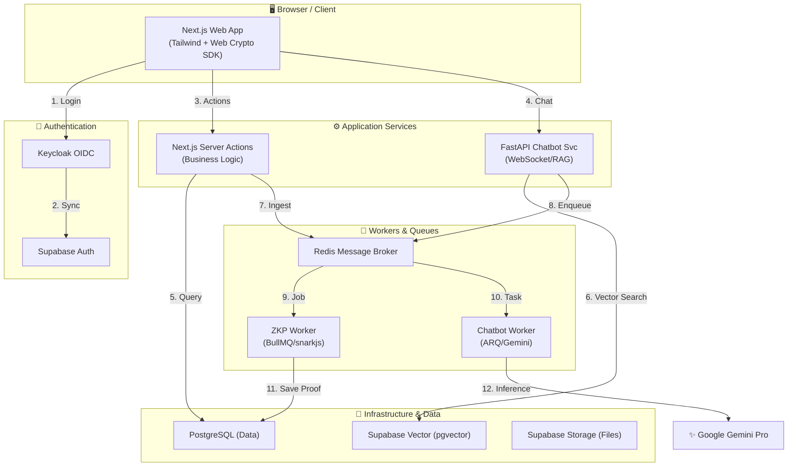

# Claimly: Privacy-Preserving Health Management & Insurance Claim Platform

Claimly adalah solusi modern untuk pengelolaan rekam medis dan klaim asuransi kesehatan yang mengutamakan privasi data pasien menggunakan teknologi kriptografi mutakhir (ZKP) dan kecerdasan buatan (AI).

---

## 🏗️ Arsitektur Sistem

Berikut adalah gambaran arsitektur sistem Claimly yang menghubungkan autentikasi, layanan utama, hingga pemrosesan ZK dan AI secara asinkron.



---

## 1. Problem Statement

Projek ini lahir untuk menyelesaikan tantangan krusial dalam dunia kesehatan:

*   **Risiko Privasi Data Medis**: Dalam proses klaim tradisional, pasien terpaksa membagikan seluruh isi rekam medis kepada asuransi. Data sensitif ini berisiko disalahgunakan (misalnya untuk menolak klaim di masa depan atau menaikkan premi secara sepihak).
*   **Kurangnya Blind Verification**: Belum ada mekanisme yang memungkinkan asuransi memverifikasi keabsahan klaim (apakah penyakit ditanggung atau tidak) tanpa harus membaca detail penyakit pasien secara eksplisit.
*   **Kompleksitas Data bagi Pasien**: Laporan rekam medis seringkali berisi istilah teknis yang sulit dipahami pasien awam. Pasien membutuhkan asisten pintar yang bisa memberikan wawasan cepat dari data medis mereka tanpa mengorbankan keamanan data tersebut.

---

## 2. Solusi yang Ditawarkan

Claimly menyelesaikan masalah di atas dengan pendekatan **Privacy-First**:

*   **Implementasi ZKP**: Mengaktifkan proses verifikasi "buta" di mana asuransi mendapatkan kepastian klaim valid secara matematis tanpa pernah melihat diagnosis asli pasien.
*   **Enkripsi End-to-End (E2EE)**: Memastikan data medis hanya bisa dibuka oleh kunci rahasia milik pasien dan rumah sakit terkait.
*   **AI Medical Assistant (RAG)**: Menyediakan chatbot cerdas yang mampu menjawab pertanyaan seputar rekam medis dengan konteks yang akurat dan aman.

---

## 3. Implementasi Teknologi Utama

### 🔐 Zero-Knowledge (ZKP) & Enkripsi
Teknologi kuncir untuk menjaga kerahasiaan data medis:

*   **Apa itu ZK Circuit?**: Secara sederhana, ZK Circuit adalah "logika matematika" yang diprogram untuk memeriksa sekumpulan syarat (input) tanpa perlu mengetahui atau membocorkan isi input tersebut. Jika semua syarat terpenuhi, sirkuit akan mengeluarkan bukti (Proof) yang sah.
*   **Verifikasi Klaim Pintar**: Sirkuit ZKP kami memverifikasi:
    *   **Diagnosis Validity**: Apakah kode ICD-10 pasien ada di dalam daftar yang ditanggung polis (menggunakan struktur *Merkle Tree*).
    *   **Procedure Match**: Apakah tindakan medis yang dilakukan sesuai dengan diagnosis yang diderita dan ada di dalam daftar yang ditanggung polis.
    *   **Cost & Date Limit**: Memastikan biaya tidak melebihi limit polis dan tanggal berobat masih dalam masa aktif polis.
*   **Enkripsi di Browser (Web Crypto API)**:
    *   Menggunakan skema **ECIES (ECDH)** untuk pertukaran kunci aman.
    *   Enkripsi catatan medis menggunakan **AES-256-GCM** langsung di sisi browser sebelum dikirim ke server.

### 🤖 Kecerdasan Buatan (AI RAG Chatbot)
Layanan chatbot medis yang dibangun dengan privasi sebagai prioritas:

*   **RAG (Retrieval-Augmented Generation)**: Chatbot mengambil potongan data medis yang relevan dari *Vector Store* (Supabase Vector) untuk memberikan jawaban yang berbasis fakta medis pasien.
*   **Zero-Persistence Processing**: Data medis yang didekripsi untuk keperluan pengolahan AI hanya berada di memori (RAM) sementara dan tidak pernah disimpan secara permanen di server chatbot.
*   **Integrasi Gemini Pro**: Menggunakan model Google Gemini Pro untuk memahami konteks medis yang kompleks dan memberikan jawaban yang empatik namun akurat.

---

## 4. Tech Stack Utama

*   **Web Framework**: Next.js (App Router), Tailwind CSS, shadcn/ui.
*   **Authentication**: Keycloak (OIDC) & Supabase Auth.
*   **Backend & Cloud**: Supabase (Postgres, Realtime, Storage, Edge Functions).
*   **Cryptography**: Circom & snarkjs (ZK-SNARKs), Web Crypto API.
*   **Asynchronous Processing**: FastAPI (Python), Redis, BullMQ (ZKP Worker), ARQ (Chatbot Worker).
*   **AI Engine**: Google Gemini Pro & Supabase Vector (pgvector).

---


---

## 5. Fitur Lainnya

*   **Role-Based Access Control (RBAC)**: Pemisahan akses ketat untuk Pasien, Staf RS, dan Reviewer Asuransi.
*   **Audit Trail**: Catatan aktivitas permanen untuk setiap pengajuan klaim dan akses data.
*   **Policy Management**: Pembuatan polis asuransi yang otomatis dikonversi menjadi akar kriptografi (*Merkle Root*).
*   **Real-time Notifications**: Pemberitahuan instan status klaim menggunakan Supabase Realtime.

---

## 6. Cara Menjalankan Proyek

### Prasyarat

Pastikan sudah terinstall di mesin Anda:
- [Docker Desktop](https://www.docker.com/products/docker-desktop/) (termasuk Docker Compose)
- [Node.js 20+](https://nodejs.org/)
- [Supabase CLI](https://supabase.com/docs/guides/cli) — untuk menjalankan Supabase lokal

### 6.1 Menjalankan Secara Lokal (Development)

```bash
# 1. Install dependencies
npm install

# 2. Salin file environment dan isi nilai yang sesuai
cp .env.example .env.local

# 3. Jalankan Supabase lokal
supabase start

# 4. Jalankan Redis (menggunakan Docker)
docker run -d --name redis-stack -p 6379:6379 redis/redis-stack-server:latest

# 5. Jalankan aplikasi
npm run dev
```

Aplikasi berjalan di `http://localhost:3000`.

---

### 6.2 Menjalankan dengan Docker

Pendekatan ini menjalankan Next.js di dalam container Docker, sementara Supabase, Redis, dan Keycloak tetap berjalan sebagai container terpisah yang terhubung melalui Docker network.

#### Langkah 1 — Siapkan Service Eksternal

Pastikan container berikut sudah berjalan sebelum build:
- **Supabase**: `supabase start` (atau jalankan stack Supabase via Docker Compose)
- **Redis**: `docker run -d --name redis-stack -p 6379:6379 redis/redis-stack-server:latest`
- **Keycloak**: Pastikan container Keycloak sudah berjalan

#### Langkah 2 — Buat Docker Network

```powershell
docker network create claimly_network
```

Kemudian hubungkan semua service ke network tersebut:

```powershell
docker network connect claimly_network redis-stack
docker network connect claimly_network supabase_kong_claimly
docker network connect claimly_network keycloak
```

#### Langkah 3 — Konfigurasi Environment

```powershell
# Salin file example dan isi dengan nilai yang sesuai
cp .env.example .env.docker
```

Edit `.env.docker` dan sesuaikan nilai berikut:

| Variabel | Nilai untuk Docker |
|---|---|
| `NEXT_PUBLIC_SUPABASE_URL` | `http://host.docker.internal:54321` |
| `NEXT_PUBLIC_KEYCLOAK_URL` | `http://host.docker.internal:8080` |
| `REDIS_URL` | `redis://redis-stack:6379` |
| `REDIS_HOST` | `redis-stack` |

> **Catatan**: `host.docker.internal` adalah hostname khusus Docker Desktop (Windows/Mac) yang mengarah ke mesin host. Ini memungkinkan URL yang sama bekerja dari dalam container maupun dari browser.

#### Langkah 4 — Build dan Jalankan

```powershell
# Build Next.js menggunakan .env.docker
npm run build:docker

# Build Docker image
docker-compose build claimly

# Jalankan container
docker-compose up -d claimly
```

#### Langkah 5 — Verifikasi

```powershell
# Cek status container
docker-compose ps

# Lihat log aplikasi
docker-compose logs -f claimly
```

Jika berhasil, log akan menampilkan:
```
claimly-1 | ▲ Next.js 16.2.1
claimly-1 | ✓ Ready in Xms
claimly-1 | [Instrumentation] ZKP Verification Queue initialized and ready.
claimly-1 | ✅ Connected to Redis
```

Aplikasi dapat diakses di `http://localhost:3000`.

#### Perintah Umum

```powershell
# Hentikan container
docker-compose down

# Hentikan dan hapus volume
docker-compose down -v

# Rebuild setelah ada perubahan kode
npm run build:docker && docker-compose build claimly && docker-compose up -d claimly

# Lihat log realtime
docker-compose logs -f claimly
```

---

© 2026 Claimly - Built for Privacy and Security.

